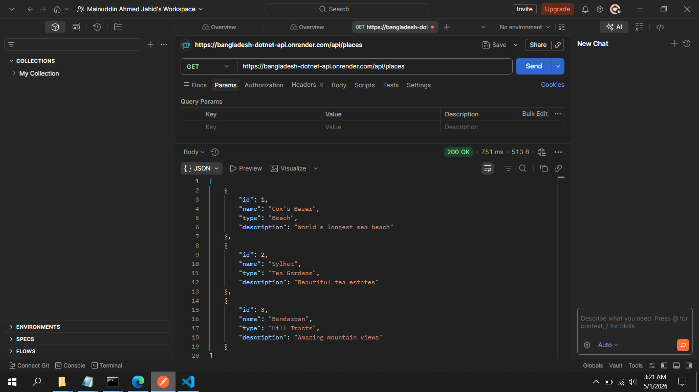

# Bangladesh Tourism API

A simple REST API for tourist places in Bangladesh, built with ASP.NET Core. This API serves data to the [Bangladesh Tourism React App](https://github.com/jahidmainuddinahmed176176/bangladesh-tourism).

🌐 **Live API:** [https://bangladesh-dotnet-api.onrender.com](https://bangladesh-dotnet-api.onrender.com)

🚀 **Base URL:** `https://bangladesh-dotnet-api.onrender.com`

---

## ✨ API Endpoints

| Method | Endpoint | Description |
|--------|----------|-------------|
| GET | `/` | Welcome message |
| GET | `/api/places` | Get all tourist places |
| GET | `/api/places/{id}` | Get a single place by ID (1, 2, or 3) |

---

## 📊 Example Response from `/api/places`

```json
[
  {
    "id": 1,
    "name": "Cox's Bazar",
    "type": "Beach",
    "description": "World's longest sea beach"
  },
  {
    "id": 2,
    "name": "Sylhet",
    "type": "Tea Gardens",
    "description": "Beautiful tea estates"
  },
  {
    "id": 3,
    "name": "Bandarban",
    "type": "Hill Tracts",
    "description": "Amazing mountain views"
  }
]


```


## 📸 API in Action



*GET request to `/api/places` returning tourist data*

---

## 🧪 CI/CD Test Status


*Automated API tests run on every push to GitHub*
